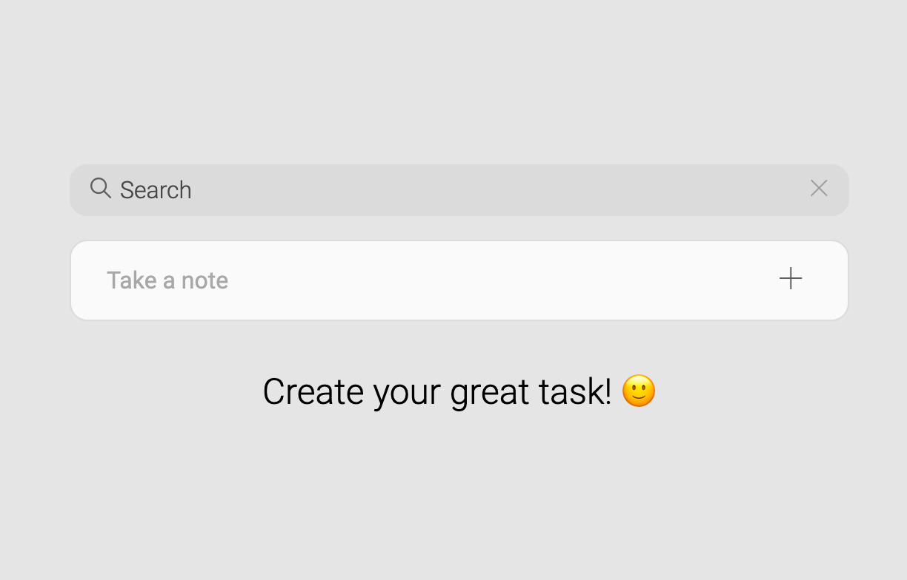
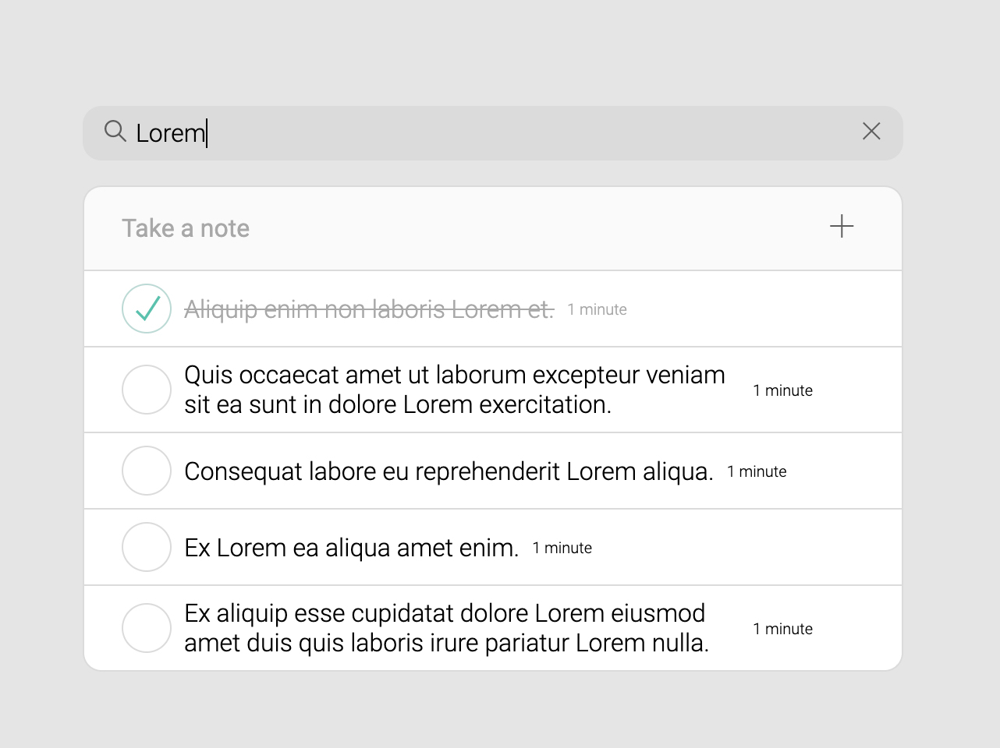
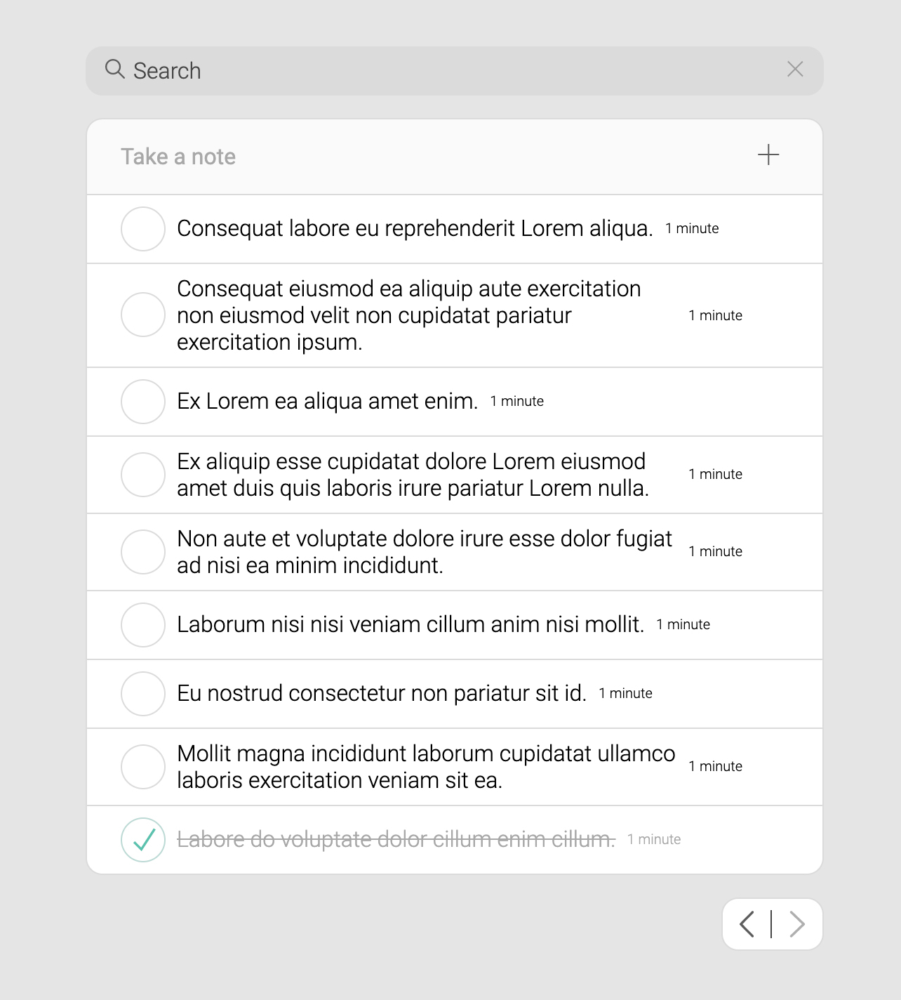

# Simple Todo
Written with Vue Composition API and TypeScript.

For running this app is required to run server, included in this repo. Backend for todo-server is made by Bitpanda.
Backend: [todo-server](./server/README.md)

*Responsive and simple*

*Searching among tasks*

*Auto-pagination*
